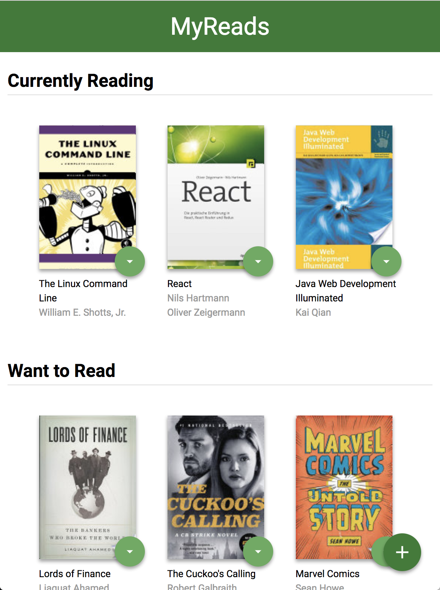

# MyReads: A Book Tracking App

## Overview
A bookshelf app that allows you to select and categorize books you have read, are currently reading, or want to read. 
This project emphasizes using React to build the application and provides an API server and client library that you will use to persist information as you interact with the application.




## Getting Started
### Setup
- Download ZIP file.
- Or, clone the repository.
```
> git clone https://github.com/gyumin-kim/my-reads
```
- Move to the directory in terminal. `cd ~/.../my-reads`

### Install
```
> npm install
```

### Run
```
> npm start
```